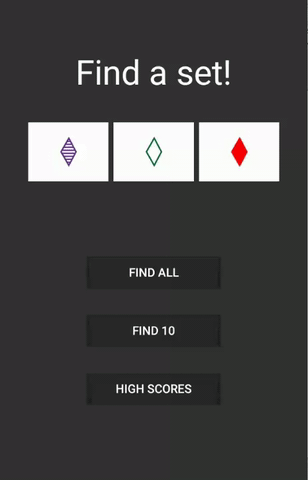
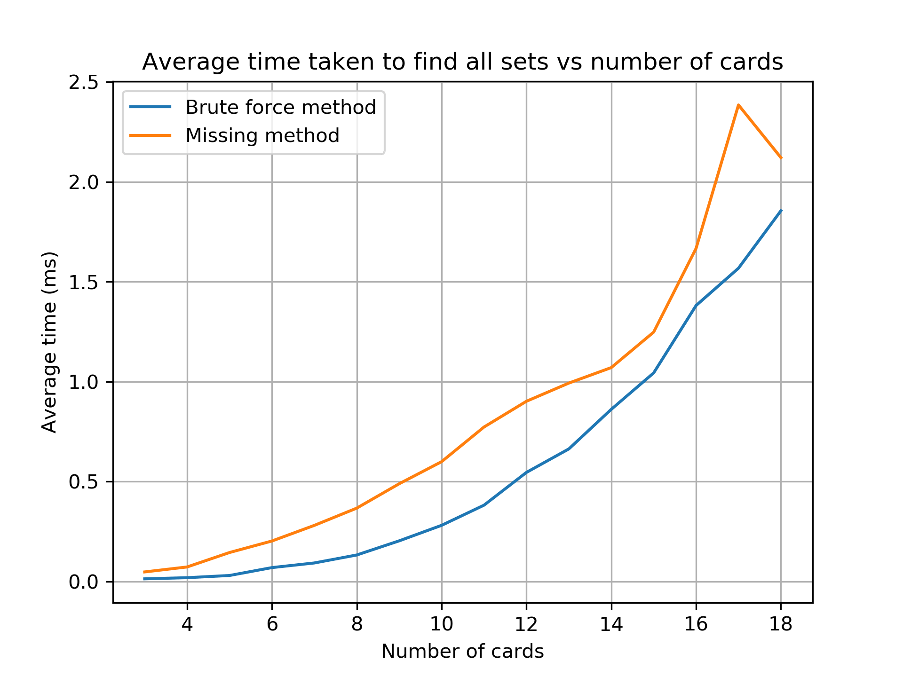
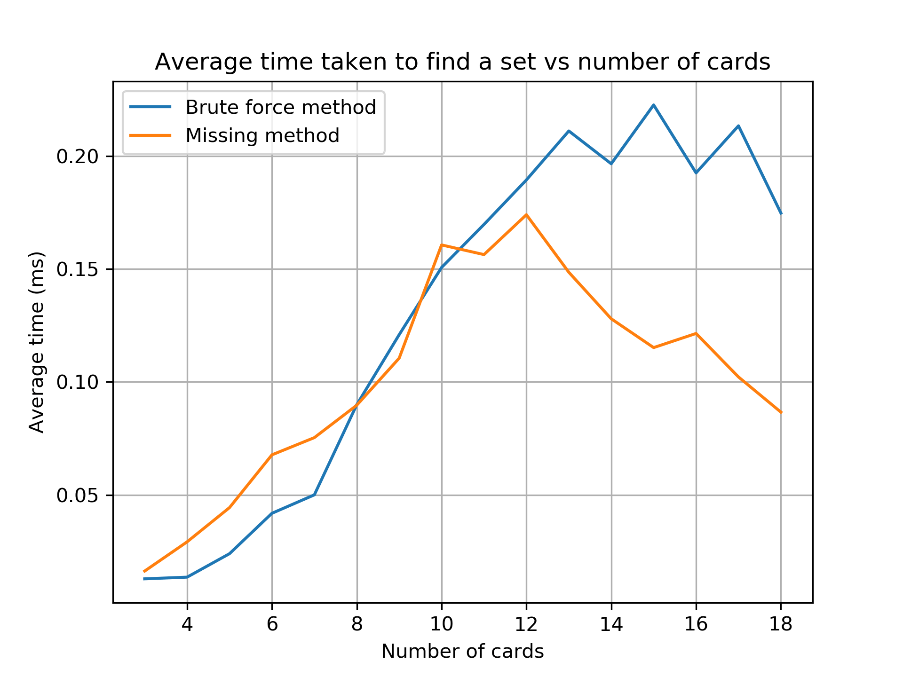

# set-solving-bot

This project was to automate an Android app version of the card game Set. I chose ["Find a set!"](https://play.google.com/store/apps/details?id=com.nelis.set) because it is a good copy of the real game and it has an offline high score. I don't want to cheat on an online leaderboard, this project is just for fun.

## What is Set?
Set is a card game more information about it is on [wikipedia](https://en.wikipedia.org/wiki/Set_(card_game)), I will however summarise the problem. The player is presented with some cards that have four properties (number of shapes, shape, shading, and colour). Each property has three possibilities. The object of the game is to find a set. A set is three cards that for all four individual properties the possibilities are all the same or all different. Once this set is found it is removed and replaced by more cards.

## Comparing methods to find sets
Usually there are 12 cards displayed to the player, this has only 220 combinations so brute force can be used to find valid sets, this is the brute force method.

For any two cards there is one other card needed to form a set. One other way to solve this is to look at every combination of 2 cards, work out the 'missing card' and then see if this card is in the other cards. For 12 cards there are only 66 combinations however the check is harder. I called this the missing method.

I simulated the time taken to solve this problem for different amounts of cards using both methods. In the real game there will only ever be 3, 6, 9, 12, 15, 18 or 21 cards, usually only 12 or 15. As shown below when trying to find all sets the missing method is not as as good as brute force. However in this game you do not need to find all sets just one per game state. Finding just one set is much faster. As shown below there is a small advantage to the missing method in the region that is most important (12 and 15). Both methods take a fraction of a millisecond.

Both graphs show an average of 10,000 games per number of cards.

 | 
:-------------------------:|:-------------------------:

# How to automate the android game

The main interest of this project was not to solve the game of Set but learn how to automate the Android app.

The problem can be separated into 3 sections:

* Getting an image of the cards
* Recognising the cards
* Clicking the cards

## Getting an image of the cards
First I was getting the phone screen from [Android Debug Bridge (ADB)](https://developer.android.com/studio/command-line/adb), this was however slow and in the end I used [scrcpy](https://github.com/Genymobile/scrcpy) to livestream my phone to my laptop and take screen shots of my laptop to get the phones screen. This is a weird way to get the phones screen and has some issues with inconsistent latency however it is much faster than ADB and any other method I tried. This screenshot was then cropped to get each individual card.

## Recognising the cards
My final solution to recognise the cards was to find the colour of the darkest pixel to figure out the objects colour. Threshold the cards then flood fill the background to get the filled in shapes, work out how many objects there are by detecting the edges along a strip through the centre of the filled in card (2 edges per object). Inferring the shape from the volume of the filled in card and the working out the shading from how filled in the shape is.

## Clicking the cards
Again ADB was initially used but it was too slow (it takes roughly 0.25 seconds per click) so I switched to using the win32api to click the screen via [scrcpy](https://github.com/Genymobile/scrcpy).

# Final comments
My first implementation with ADB for both getting the screen and clicking the cards took 29 to 35 seconds to play the game. The final implementation with scrcpy and win32api took 4 or 5 seconds.

A more detailed write-up will be made on my blog.
